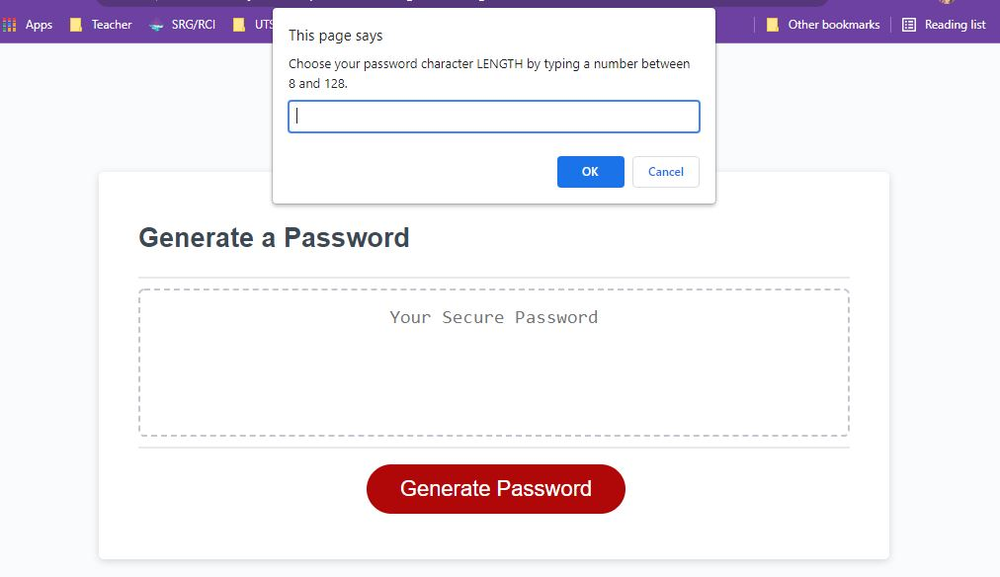
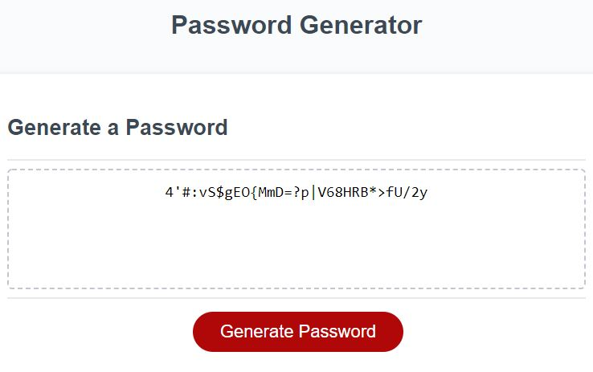

# Password-Generator

GitHub Link: https://github.com/chellesjord/ProfessionalPortfolio

Deployed Link: https://chellesjord.github.io/ProfessionalPortfolio/

## Description
When user pushes "Generate Password", the user is presented with a series of prompts for password criteria (including password length, lowercase, uppercase, numeric, and/or special characters).

If user does not select attributes for the Generate Password to function properly, the user will be guided to try again.

If password criteria has been selected, the generate password is written to the page.

Code types used: html, css, javascript

<
<

## Questions

> If you have any questions contact me at m.kayejordan@gmail.com or through my Github Link: https://github.com/chellesjord